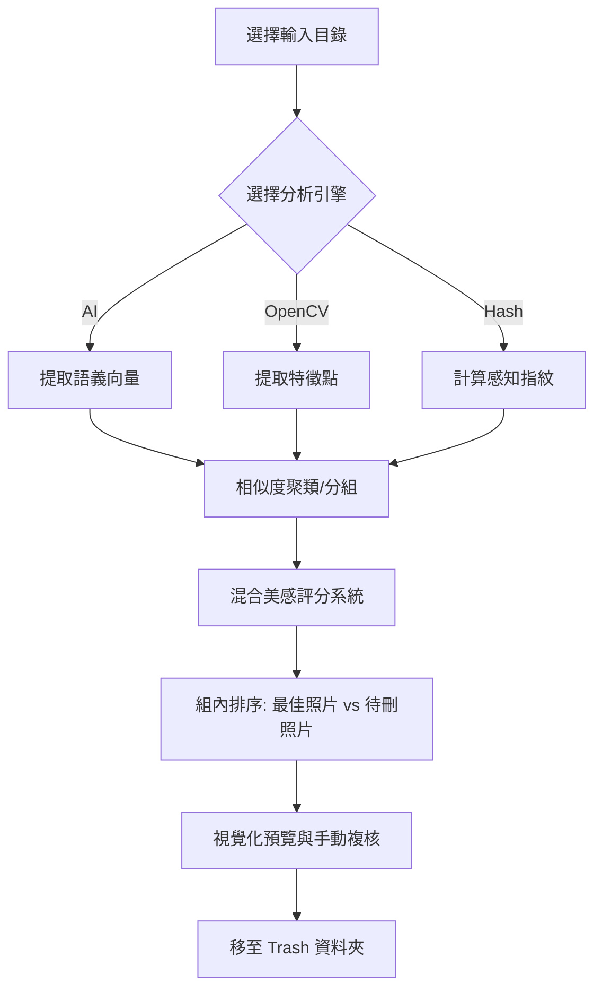

# Image Similarity Pro (美感篩選版)

**Image Similarity Pro** 是一款基於 PyQt6 開發的高階桌面應用程式，旨在幫助攝影師與設計師快速清理資料夾中高度相似的圖片。透過**混合式 AI 與電腦視覺 (CV) 美感評分系統**，程式能自動在相似圖片組中挑選出最具美感的「精選照片」，並提供安全的批量清理方案。

---

## 📸 應用視角

> [!TIP]
> **最佳使用場景：** 處理連拍照片、整理不同解析度的重複素材、或是從大量相似構圖中篩選出對焦最精準、色彩最豐富的佳作。

---

## ✨ 核心技術特色

### 🕵️‍♂️ 精準的比對引擎
程式提供三種不同維度的分析引擎，滿足從「找重疊內容」到「找相似構圖」的不同需求：
*   **🧠 AI 語義特徵：** 利用深度學習模型 (如 **ResNet18**, **MobileNet_V2**, **EfficientNet**) 提取圖片的高維度特徵向量，透過 **Cosine Similarity (餘弦相似度)** 比對構圖與意境的相似性。
*   **🧬 OpenCV ORB：** 使用傳統電腦視覺特徵點檢測與描述子提取，適合快速比對具備相同物體或紋理的圖片。
*   **⚡ 雙重感知哈希 (ImageHash)：** 結合 **pHash (感知哈希)** 與 **ColorHash (色彩哈希)**，同時考慮結構與性能，提供極速的重複圖搜尋。

### 🏆 混合式美感評分系統
這是本工具的核心，結合了機器學習的「感性」與數學算法的「理性」：
1.  **AI 語義評分 (權重 70%)：** 基於 OpenAI 的 **CLIP** 預訓練模型，將圖片與「高品質專業攝影」之語義進行對應，分析構圖層次。
2.  **CV 技術評分 (權重 30%)：** 多維度量化圖片品質：
    *   **清晰度 (Sharpness)：** 使用 Laplacian 算子計算邊緣變異數，偵測對焦是否精準。
    *   **對比度 (Contrast)：** 計算亮度標準差，篩選層次感明顯的照片。
    *   **色彩豐富度 (Colorfulness)：** 基於 Hasler & Suesstrunck 演算法評估色彩表現。
    *   **曝光平衡懲罰：** 自動懲罰過曝或曝光不足的影像。

---

## 🛠️ 安裝與執行

### 1. 安裝環境依賴
本程式需要 Python 3.8+ 及相關視覺運算庫：

```bash
pip install PyQt6 Pillow ImageHash opencv-python numpy scikit-learn torch torchvision transformers
```

> [!IMPORTANT]
> **硬體加速建議：**
> *   **Windows/Linux：** 如果具備 NVIDIA GPU，建議安裝 [CUDA 版本的 PyTorch](https://pytorch.org/) 以釋放 CLIP 模型的運算潛能。
> *   **macOS：** 程式會自動嘗試調用 **MPS (Metal Performance Shaders)** 進行硬體加速。

### 2. 啟動應用程式
```bash
python SimilarityAPP.py
```

---

## 🚀 工作流程



---

## 📖 操作手冊

1.  **目錄選擇：** 點擊「📁 檔案目錄設定」選擇來源資料夾。
2.  **引擎配置：** 
    *   追求精準與構圖相似請選 **AI 語義特徵** (相似度建議設在 0.85)。
    *   追求速度或內容重疊請選 **感知哈希**。
3.  **掃描與自動排序：** 點擊「🔍 開始掃描與美感評估」。程式會自動將每組中「評分最高」的圖片標記為 **👑 最佳**，其餘標記為 **🗑️ 待刪**。
4.  **安全清理：**
    *   **單組處理：** 針對特定分組點擊「處理此組」。
    *   **批量處理：** 確認無誤後點擊「批量處理所有組」，非最佳照片會被移動到子目錄 `Trash/`。

---

## ⚠️ 注意事項

> [!WARNING]
> **初次運行：** 當您切換新的 AI 模型或初次執行美感評估時，程式需從雲端下載約數百 MB 的模型權重檔案。請保持網路連線。

*   **路徑支援：** 完整支援包含簡繁中文、特殊字元的路徑讀取與寫入。
*   **格式支援：** `.jpg`, `.jpeg`, `.png`, `.bmp`, `.webp`, `.tiff` (目前僅限於常見靜態影像格式)。
*   **性能備註：** 在處理數千張高像素照片時，AI 模式會顯著消耗記憶體與運算資源。
